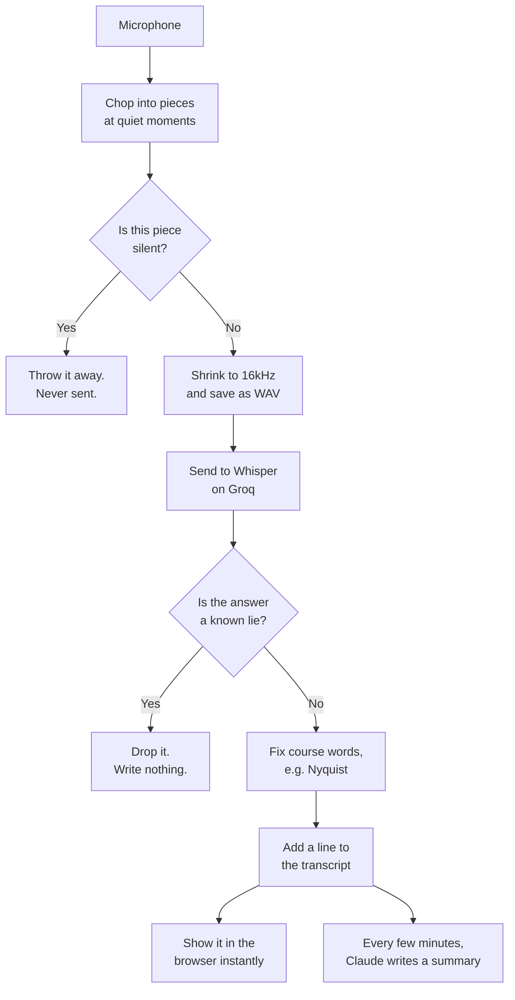

# How Scribe works

This page explains how Scribe turns a lecture into notes. It is written to be readable
by someone who has never seen the code. There is a table of exact settings at the
bottom for people who want the numbers.

## The short version

You press record. Scribe listens through your microphone, chops the sound into small
pieces, sends each piece away to be turned into words, and glues the words back
together into a transcript. While that happens, it also keeps writing a summary of
what has been said so far. When you press stop, it writes the full notes.

Think of it like a friend sitting next to you in class. They listen, they scribble
down what the lecturer says, and every few minutes they jot a short summary in the
margin so you can see the shape of the lesson without rereading everything.

## The journey of your voice

### 1. Listening

The browser takes sound from your microphone. Sound is just numbers: thousands of
tiny measurements of air pressure every second.

### 2. Chopping it up

Scribe cannot send an entire hour of lecture at once, so it cuts the sound into
pieces of roughly twenty seconds.

Here is the clever part. It does **not** cut on a timer. A timer would often cut
right through the middle of a word, and half a word turns into either nothing or the
wrong word. Instead Scribe looks at the sound and finds the **quietest moment** in a
window between fifteen and twenty five seconds, which is almost always the tiny gap
between two words, and cuts there.

### 3. Throwing away silence

Before anything is sent, Scribe measures how loud the piece is. If it is basically
dead air, the piece is deleted and never sent.

The rule is deliberately strict about what counts as silent. Sending a quiet piece by
mistake only costs a fraction of a penny. Deleting a real piece by mistake loses a
chunk of your lecture forever. So a piece has to be genuinely, properly silent before
it gets dropped.

### 4. Turning sound into words

The surviving piece is shrunk to 16,000 measurements per second, in mono, which is
exactly the format the transcription model wants. Then it is sent to **Whisper**, a
speech to text model made by OpenAI, running on **Groq**, a company whose chips run
these models very fast.

Whisper sends back text.

### 5. Whisper is a guesser, not a listener

This matters more than anything else on this page.

Whisper does not "hear words and write them down". It writes the **most likely next
word**, over and over, using the sound as a hint. It is closer to a very good guesser
than to a tape recorder.

That is why it is so good at accents, mumbling and background noise. It is also why
it does something strange: **when it hears nothing at all, it does not return an
empty answer.** It still guesses. And because it learned from millions of hours of
YouTube videos with subtitles, its favourite guess for silence is whatever people say
at the end of YouTube videos:

> "Thank you."
> "Thanks for watching!"
> "[Music]"

It writes these confidently, in perfect grammar, when the room was completely quiet.

### 6. Why one small lie becomes a big one

Scribe tells Whisper what was said just before, so it keeps spelling names and
technical terms the same way through the whole lecture. That is genuinely useful. It
is how "Nyquist" stays "Nyquist" instead of becoming "nikeist" halfway through.

But it creates a trap. If a fake "Thank you." gets written down, it becomes part of
what Scribe tells Whisper next time. That makes "Thank you." more likely again. Which
gets written down. Which makes it more likely again.

One mistake can walk through an entire quiet stretch of a lecture and fill it with
dozens of fake "Thank you." lines.

Scribe stops this in two places:

1. **Before sending.** The silence check in step 3. If no sound goes out, no lie comes
   back.
2. **After receiving.** A list of about twenty five known fake phrases. If the *whole*
   piece is nothing but one of them, it is thrown away and never written down, so it
   can never be fed back in.

The second check is deliberately gentle. It only fires when the entire piece is the
suspicious phrase. If a lecturer says "thank you" in the middle of a real sentence,
that is a real thank you, and it is kept.

### 7. Writing it down

The text gets a last pass to fix course specific words, then becomes a line in the
transcript with a timestamp, and appears in your browser straight away.

Every few minutes, everything said so far is sent to **Claude**, which writes a
running summary in the side panel. When you press stop, Claude reads the whole
transcript once more and writes the final revision notes.

## Two design choices worth knowing

**The browser never waits.** When a piece of audio is uploaded, the server replies
"got it" immediately, before doing any transcription. Recording must never stutter
because the network is slow. Finished text is pushed to the page separately as it
becomes ready.

**Everything stays on your machine.** The server only accepts connections from your
own computer, and it refuses commands that come from other websites. Audio and
transcripts are written to a folder on your disk. The only things that leave are the
audio pieces going to Groq and the transcript text going to Claude.

## Exact settings

| Thing | Value | Where |
| --- | --- | --- |
| Transcription model | `whisper-large-v3-turbo` | `src/server/groq.ts` |
| Summary model | `claude-opus-5` | `src/server/claude.ts` |
| Chunk length | ~20s, cut in a 15 to 25s window | `src/web/audio/chunker.js` |
| Quiet frame scanned | 100 ms | `src/web/audio/chunker.js` |
| Silence threshold | RMS 0.0025, about -52 dBFS | `src/web/audio/level.js` |
| Audio sent as | 16 kHz mono, 16-bit PCM WAV | `src/web/audio/resample.js`, `wav.js` |
| Randomness | temperature 0, so the same audio gives the same text | `src/server/groq.ts` |
| Retries | 3 attempts, backoff, honours `retry-after` | `src/server/retry.ts` |
| Server address | `127.0.0.1:4747` | `src/server/index.ts` |

## Where the code lives

**Browser side, `src/web/`**

| File | Job |
| --- | --- |
| `audio/worklet.js` | Taps the microphone on the audio thread |
| `audio/level.js` | Measures loudness, decides what counts as silence |
| `audio/chunker.js` | Finds the quiet moment to cut at |
| `audio/resample.js` | Shrinks the audio to 16 kHz without losing samples |
| `audio/wav.js` | Writes the WAV file |
| `audio/recorder.js` | Runs the whole recording, handles the mic being taken away |
| `upload.js` | Queues pieces and sends them |
| `app.js` | The page itself |

**Server side, `src/server/`**

| File | Job |
| --- | --- |
| `groq.ts` | Calls Whisper |
| `hallucination.ts` | The list of known fake phrases |
| `session.ts` | Runs one recording, one piece at a time, in order |
| `transcript.ts` | Holds the lines |
| `claude.ts` | Running and final summaries |
| `index.ts` | Routes and static files |

**Shared, `src/shared/`**

Used by both sides. It is served to the browser at `/shared`, which is easy to
forget: a browser file importing from here will 404 and take the whole page down
with it if that mount is ever removed. See `tests/module-graph.test.ts`, which
exists to catch exactly that.
